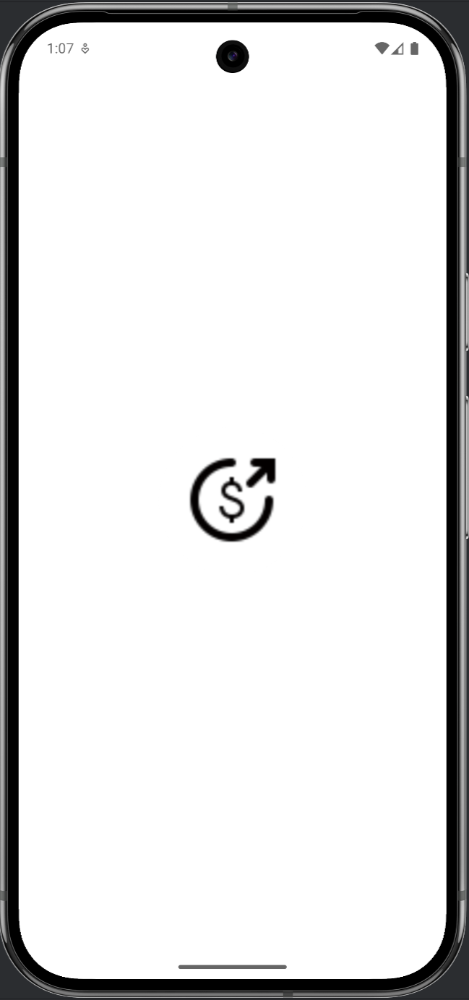
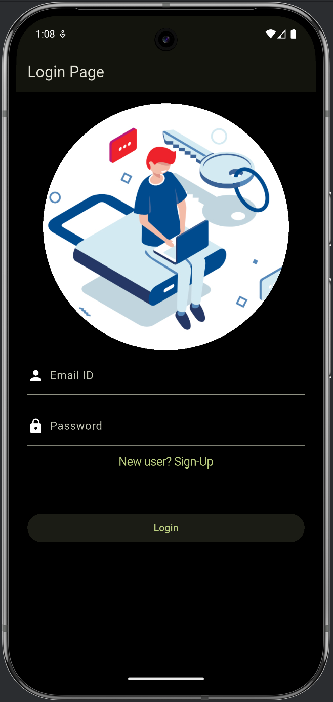
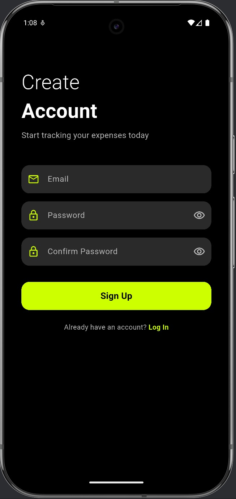
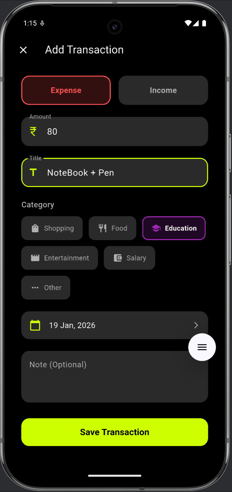
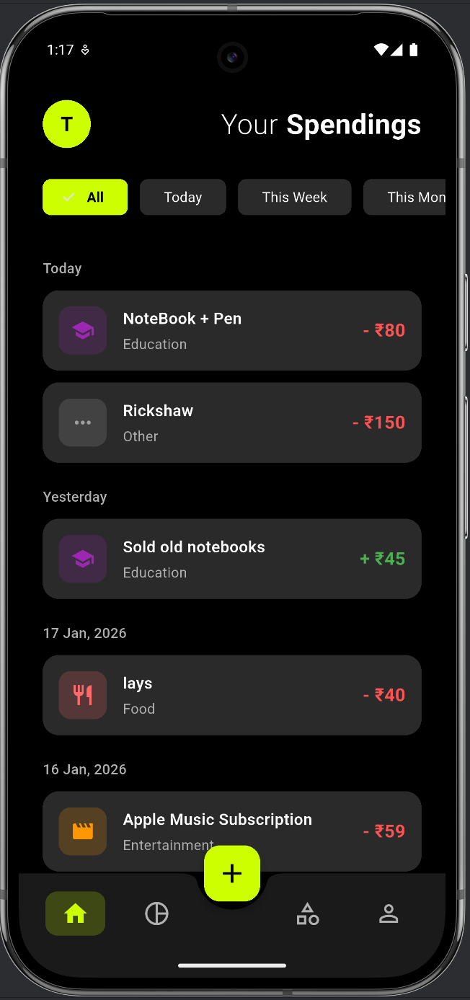
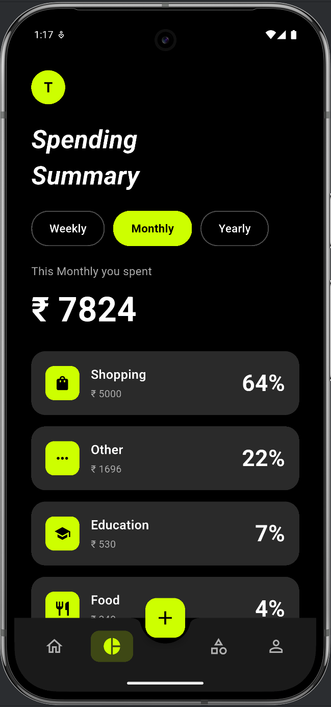
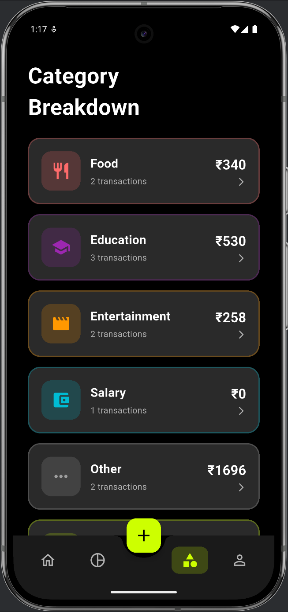
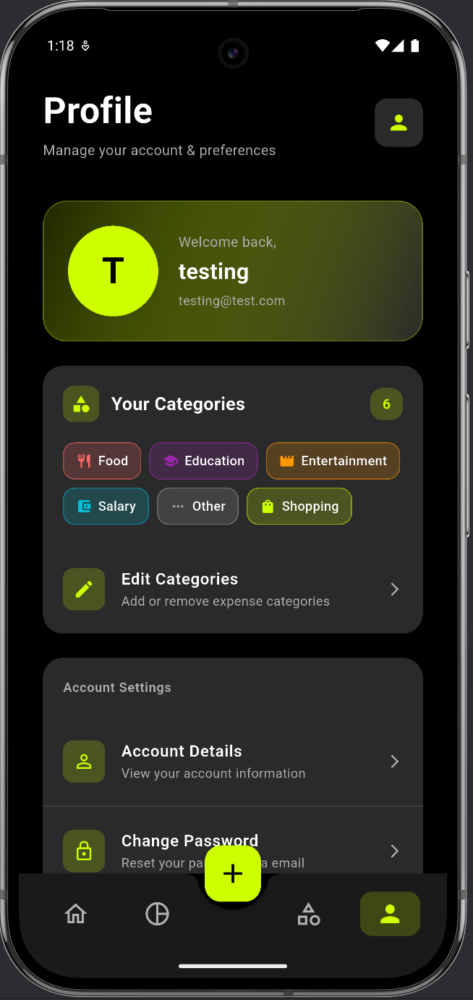

# 📘 SpendSense [](https://flutter.dev)
[](https://firebase.google.com)
[](LICENSE)

SpendSense is a mobile expense tracking application built with Flutter. It allows users to log and categorize their income and expenses, view summaries, and manage personal finances with a clean, intuitive interface and Firebase backend.

This README gives you a complete overview, setup instructions, feature list, and how others can contribute.

## 🚀 Features

SpendSense includes the following key features:

User Authentication
Sign up and login with secure Firebase Authentication.

Add Transactions
Record income and expenses with amount, title, category, date, and notes.

Categorical Tracking
Transactions can be categorized and filtered.

User-Editable Categories
Users can customize which categories are enabled for tracking.

Firestore Integration
Transactions are synced with Cloud Firestore for persistence and cross-device access.

Summary & Insights
(Optional in future versions) Chart/summary views of spending over time.

## 🧱 Architecture Overview

This project follows a modular pattern using Flutter’s widget tree and Firebase for backend services:

* State Management → Provider

* Backend → Firebase (Authentication + Firestore)

* UI Framework → Flutter

## 📱 App Screenshots

### Splash & Authentication
<p align="center">
  
  
  
</p>

### Add Transactions
<p align="center">
  
  
</p>

### Insights & Summaries
<p align="center">
  
  
  
</p>

### Profile & Settings
<p align="center">
  
</p>

## 🚀 Getting Started

### Prerequisites
- Flutter SDK 3.0+
- Firebase account
- Android Studio / VS Code

### Installation

1. Clone the repo
```bash
   git clone https://github.com/Priyansh956/SpendSense.git
   cd SpendSense
```

2. Install dependencies
```bash
   flutter pub get
```

3. Set up Firebase
   - Create a Firebase project
   - Add `google-services.json` to `android/app/`
   - Add `GoogleService-Info.plist` to `ios/Runner/`

4. Run the app
```bash
   flutter run
```
